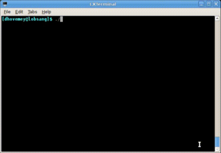

Milestone 1 due **Tuesday, April 15th**

Milestone 2 due **Tuesday, April 29th**

*Updated 4/7* - Clarified which element should be used when testing **avg\_of\_neighbors** in milestone 1; clarified that if insane extra credit is implemented for milestone 2, the "plain" functionality must be preserved.

*Updated 4/8* - Corrected due date for milestone 2.

Getting Started
===============

Start by downloading [CS101\_Assign05.zip](CS101_Assign05.zip), saving it in the directory **H:\\CS101**.

Start a **Cygwin Bash Shell** and run the following commands:

    cd h:
    cd CS101
    unzip CS101_Assign05.zip
    cd CS101_Assign05

Using **Notepad++**, open the file

> **H:\\CS101\\CS101\_Assign05\\HeatTransfer.cpp**

You will add your code to this file.

Run the command

    make

when you are ready to compile the program. To run the program, run the command

    ./HeatTransfer.exe

Heat Transfer
=============

Your task is to write a program that computes the temperature distribution over a flat plate. Given a rectangular plate whose sides are set to four constant temperatures, we can place a grid over the plate (see the figure below) to find the temperature at each point. The temperature can be modeled as the average of the four points above, below, to the left, and to the right.

For example, let's say that this is part of the grid:

> <table><tr><td></td><td>U</td><td></td></tr><tr><td>L</td><td>P</td><td>R</td></tr><tr><td></td><td>B</td><td></td></tr></table>

We can compute an updated temperature for point *P* as the average of the current temperatures of points *U*, *B*, *L*, and *R*.

Each time the temperature of one point changes, then, that of the four points around it will also change. After many iterations through the plate, we will find that the temperature distribution reaches equilibrium &mdash; it doesn't change much from one iteration to the next. In other words, the magnitude of the difference in temperature is less than some tolerance value for every point in the grid. At that time, we have the temperature distribution in the entire plate.

# Milestone 1

For milestone 1, implement *and test* the following functions:


void init_temp_array(double temp[HEIGHT][WIDTH], double top, double right, double bottom, double left);
void print_temperatures(double temp[HEIGHT][WIDTH]);
double avg_of_neighbors(double temp[HEIGHT][WIDTH], int row, int col);


**init\_temp\_array** should initialize all of the elements of the given temperature array.  The leftmost and rightmost columns of the array should be set to **left** and **right**, respectively.  The top and bottom rows (exclusing the leftmost and rightmost elements) should be set to **top** and **bottom**, respectively.  All other values should be set to 0.

**print\_temperatures** should print out the temperatures in the given temperature array.  Specify a fixed field width and a fixed number of decimal places so that the columns line up.

**avg\_of\_neighbors** should take a temperature array and a row and column, and return the average of the top, right, bottom, and left neighbors of that array element.  You can assume that the specified element will not be on any of the edges of the array (and so it will be guaranteed to have all four neighbors).

In order to test your functions, add code to **main** to make calls to all of these functions.  Check the output of the program to ensure that the functions are working correctly.  Here is an example run (user input in **bold**):

<pre>
Enter the top side temperature: <b>150</b>
Enter the right side temperature: <b>200</b>
Enter the bottom side temperature: <b>110</b>
Enter the left side temperature: <b>70</b>
 70.00 150.00 150.00 150.00 150.00 150.00 150.00 150.00 150.00 200.00 
 70.00   0.00   0.00   0.00   0.00   0.00   0.00   0.00   0.00 200.00 
 70.00   0.00   0.00   0.00   0.00   0.00   0.00   0.00   0.00 200.00 
 70.00   0.00   0.00   0.00   0.00   0.00   0.00   0.00   0.00 200.00 
 70.00   0.00   0.00   0.00   0.00   0.00   0.00   0.00   0.00 200.00 
 70.00   0.00   0.00   0.00   0.00   0.00   0.00   0.00   0.00 200.00 
 70.00   0.00   0.00   0.00   0.00   0.00   0.00   0.00   0.00 200.00 
 70.00   0.00   0.00   0.00   0.00   0.00   0.00   0.00   0.00 200.00 
 70.00   0.00   0.00   0.00   0.00   0.00   0.00   0.00   0.00 200.00 
 70.00 110.00 110.00 110.00 110.00 110.00 110.00 110.00 110.00 200.00 
Average of neighbors at row=1, col=1 is 55.00
</pre>

When testing the **avg\_of\_neighbors** function, compute the average of the element at row 1, column 1 (as shown in the example above).

## Milestone 1 Hints

The **init\_temperatures** could use an **if**/**else if**/... statement to determine how to assign an initial temperature to an element: for example

<pre>
if (<i>element is on left edge</i>) {
    <i>assign the left temperature value</i>
} else if (<i>element is on the right edge</i>) {
    <i>assign the right temperature value</i>
} else ...
</pre>

# Milestone 2

For milestone 2, add the following functions:


double compute_next_temperatures(double temp[HEIGHT][WIDTH], double next[HEIGHT][WIDTH]);
void copy_temperatures(double source[HEIGHT][WIDTH], double dest[HEIGHT][WIDTH]);


The **compute\_next\_temperatures** function should set the elements in the **next** array so that they are the correct values for the next time step of the simulation, based on the values in **temp**, which represents the current time step.  Specifically, all of the interior elements should be set to the average of the four neighbors as described above.  All of the edge elements should be set to the same values as the current time step.  The value returned should be absolute value of the largest temperature change of any element.  For example, if an element has the temperature 60.0, in the current time step, and the new temperature is 64.5, then the temperature has changed by 4.5: this is the *delta* of the temperature change.  The **compute\_next\_temperatures** function should return the maximum of the deltas.

The **copy\_temperatures** function should copy all of the element values from the **source** array to the **dest** array.

Once you have these functions working and tested, use them to implement the simulation.

The simulation should prompt the user for a tolerance value.  It should then repeatedly call **compute\_next\_temperatures** and **copy\_temperatures** to simulate the spread of heat from the edges of the plate.  Note that you will need one additional array (the same dimensions as your **temp** array) to run the simulation: this loop will store the updated temperatures computed by **compute\_next\_temperatures**.  The call to **copy\_temperatures** will copy the contents of this array back into the main **temp** array.

The simulation loop should terminate once the maximum temperature change of any element (as returned by **compute\_next\_temperatures** is less than the tolerance value: at this point, equilibrium has been reached.  The program should finish by calling **print\_temperatures** to print the final temperatures, and also by printing the number of steps required to reach equilibrium.

Example run (user input in **bold**):

<pre>
Enter the top side temperature: <b>150</b>
Enter the right side temperature: <b>200</b>
Enter the bottom side temperature: <b>110</b>
Enter the left side temperature: <b>70</b>
Tolerance value: <b>0.1</b>
 70.00 150.00 150.00 150.00 150.00 150.00 150.00 150.00 150.00 200.00 
 70.00 111.05 128.01 136.81 142.64 147.58 152.90 160.10 172.49 200.00 
 70.00  96.24 114.27 126.70 136.28 144.90 154.02 165.10 179.90 200.00 
 70.00  89.74 106.26 119.66 131.12 141.97 153.41 166.52 182.09 200.00 
 70.00  86.56 101.59 114.83 126.90 138.75 151.40 165.69 182.04 200.00 
 70.00  85.04  98.93 111.49 123.25 135.10 148.06 163.04 180.52 200.00 
 70.00  84.79  97.85 109.27 119.87 130.71 143.02 158.11 177.14 200.00 
 70.00  86.37  98.63 108.16 116.56 125.18 135.48 149.46 170.02 200.00 
 70.00  92.15 102.27 108.40 113.26 118.20 124.48 134.36 153.59 200.00 
 70.00 110.00 110.00 110.00 110.00 110.00 110.00 110.00 110.00 200.00 

Done, equilibrium reached after 79 steps
</pre>

## Milestone 2 Hints

In **compute\_next\_temperatures**, the temperature values on the edges should remain at their original (fixed) values, rather than being changed to be the average of their neighbors.

The **copy\_temperatures** should copy all elements, including the fixed temperatures at the edges.

Remember that the tolerance tests the magnitude of the change in temperature. You must make sure that a change of (say) -5 degrees does not count as within your tolerance, unless the tolerance is more than 5 degrees. This tolerance should apply to each point in the plate &mdash; if one point is outside of the tolerance, the simulation continues!  You can use the **fabs** function to compute the absolute value of a **double** value.

You will need to use a flag (a variable whose value changes based on conditions) in order to tell when equilibrium is reached.

# Grading

Milestone 1:

* Declaration of array and variables: 10
* Read initial temperature values: 10
* Initialize array: 30
* Print initial temperatures: 30
* Compute the average temperature of one point (at row 1, column 1): 20

Milestone 2:

* Get the tolerance value: 5
* Compute next temperatures (placing result in a separate array): 40
* Copy next temperatures back to original array: 20
* Detect when equilibrium has been reached: 20
* Print final temperatures: 10
* Print number of steps: 5

**Insane Extra Credit** (milestone 2, up to 30 extra points): All of the above, plus give the user the option of animating the simulation using the console graphics functions from [Lab 17](../labs/lab17.html).  Each frame of the animation should render a visualization of one time step of the simulation.  Your animation might look something like this (click for full-size animation):

> 

Note that in this animation, the **HEIGHT** and **WIDTH** constants were changed to 20.  You can use the **cons\_sleep\_ms** to create a short pause between frames of the animation.  (The example above runs at 10 frames per second, meaning 100ms pauses between frames.)

**Important**: If you implement the insane extra credit option, your program must operate normally (printing the temperatures after equilibrium has been reached) if the user chooses not to view the animation.

**Coding style**: Make sure that you use meaningful variable names, that your code is properly indented, and that you include some comments explaining how the code works. Credit may be deducted if you use poor coding style.

# Submitting

To submit your work, make sure your **HeatTransfer.cpp** file is saved, and in the Cygwin window type one of the following commands (depending on whether you are submitting **Milestone 1** or **Milestone 2**).

For **Milestone 1**:

    make submit_ms1

File **Milestone 2**:

    make submit_ms2

Enter your Marmoset username and password (which you should have received by email.) Note that your password will not be echoed to the screen. Make sure that after you enter your username and password, you see a message indicating that the submission was successful.

If the **make** commands above do not work, you can [submit using the web interface](../submitting.html) (see the link for details).

**Important**: Make sure that you check the file(s) you submitted to ensure that they are correct. Log into the server using the following URL (also linked off the course homepage):

> <https://cs.ycp.edu/marmoset/>

You should see a list of labs and assignments. In the row for **assign02\_ms1** (milestone 1) or **assign02\_ms2** (milestone 2), click the link labeled **view**. You will see a list of your submissions. Download the most recent one (which should be listed first). Verify that it contains the correct files.

**You are responsible for making sure that your submission contains the correct file(s).**

<!-- vim:set wrap: ­-->
<!-- vim:set linebreak: -->
<!-- vim:set nolist: -->
