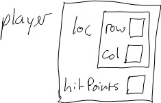

Struct initialization
=====================

The declaration of a struct variable may include an *initializer* to set initial values for the fields of the stuct variable.

Example:

    struct Point {
        double x;
        double y;
    };

    ...

    struct Point p = { 3.0, 4.5 }; // values are assigned to fields in order
    printf("p.x = %lf\n", p.x);  // prints the value 3.0
    printf("p.y = %lf\n", p.y);  // prints the value 4.5

Composition
===========

*Composition* is the technique of building a data type by *composing* other data types.

The idea is that simpler data types can serve as the building blocks for more complex data types.

For example, in a game, you might have a **Location** data type which describes locations on the game map:

    struct Location {
        int row; // a row of the map
        int col; // a column of the map
    };

You could define some useful operations for this data type, i.e. functions which have one or more parameters which are **Location**s (or pointers to **Location**s.) For example:

    // Change given Location so that its column is
    // changed by dx and its row is changed by dy.
    void moveLocation(struct Location *loc, int dx, int dy)
    {
        loc->row += dy;
        loc->col += dx;
    }

Now, let's say we are defining a **Player** data type to represent the data concerning the player's character in the game. One piece of information that the game will need to keep track of for the player character is where on the map the player character is. So, we can use composition to place an instance of the **Location** data type inside the **Player** data type:

    struct Player {
        struct Location loc; // the player character's location
        int hitPoints;       // player character's hit points
    };

We can visualize this composition as follows:

> 

A **Player** instance has two fields, a **Location** called **loc** and an **int** called **hitPoints**. Because **loc** is itself a struct instance, it has fields of its own: an **int** called **row** and an **int** called **col**.

Because the **Player** data type builds on the **Location** data type, the functions (operations) you defined to work with **Location** instances can be used to help to implement functions which perform operations on **Player** instances. For example:

    void movePlayer(struct Map *map, struct Player *player, int dx, int dy)
    {
        struct Point nextLoc;

        // set nextLoc to the location the player is trying to move to
        nextLoc = player->loc;
        moveLocation(&nextLoc, dx, dy);

        // determine if this is a legal move
        if (isLegalMove(map, nextLoc)) {
            // legal: player moves
            player->loc = nextLoc;
        }
    }

The **movePlayer** function computes the **Location** the player is trying to move to, determines whether the new location is a legal location, and, if so, updates the player's **Location**.
